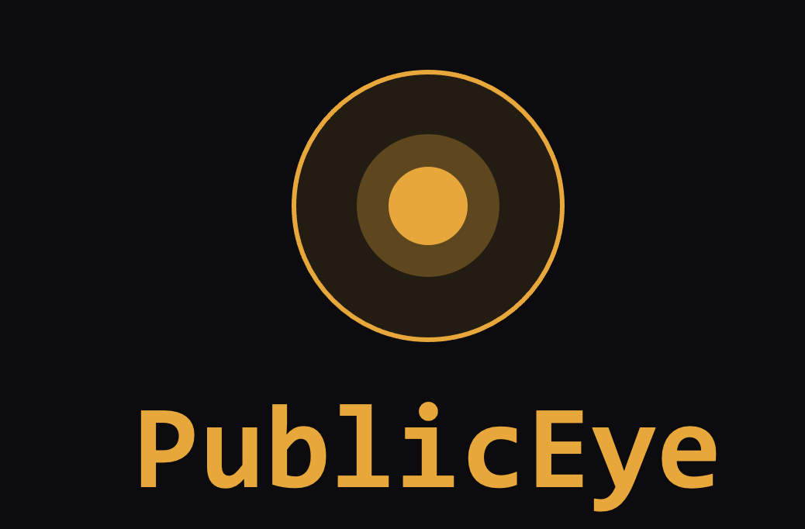
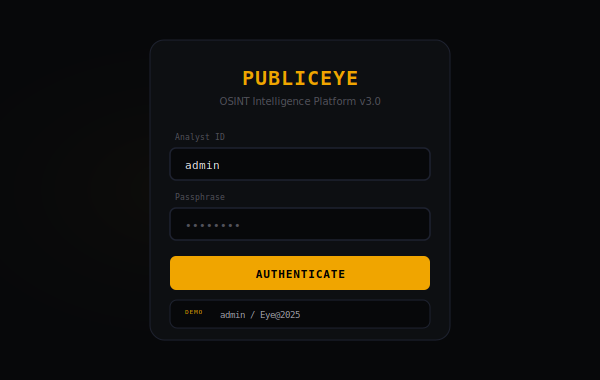
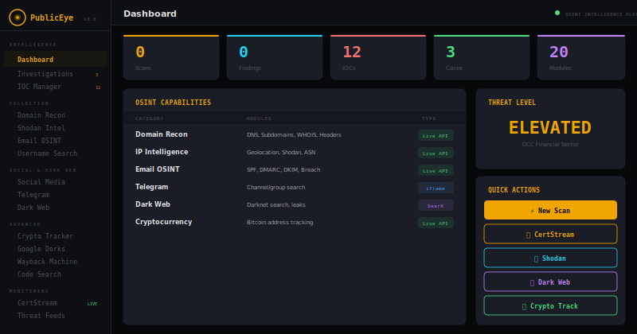
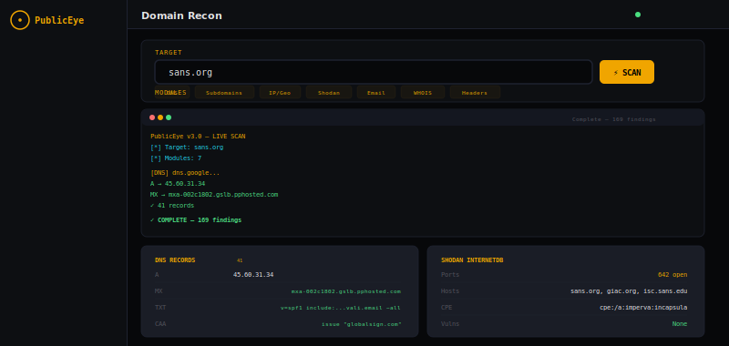

<div align="center">



<br>

[]()
[](LICENSE)
[]()
[]()
[]()
[]()

**OSINT Intelligence Platform — 20 modules, 13 categories, live APIs, zero backend**

[Live Platform](https://siteq8.github.io/PublicEye) · [Features](#-live-api-modules) · [Quick Start](#-quick-start) · [Release](https://github.com/SiteQ8/PublicEye/releases/tag/v3.0.0)

</div>

---

## What is PublicEye

PublicEye is a complete OSINT intelligence platform that runs entirely in your browser. No server, no backend, no API keys required. Every search, every lookup, every scan happens live using real public APIs — results displayed inline, never leaving the platform.

Built for analysts, investigators, and security teams who need real-time intelligence without commercial tool budgets or cloud dependencies.

---

## Screenshots

<div align="center">

### Login



### Dashboard — Intelligence Overview



### Domain Scan — Live Results from sans.org



</div>

---

## 🔍 Live API Modules

Every result is real data from public APIs — queried in real-time from your browser.

| Module | API Source | What It Does |
|--------|-----------|--------------|
| **DNS Records** | dns.google | A, AAAA, MX, NS, TXT, SOA, CNAME, CAA with SPF/DMARC flagging |
| **Subdomains** | crt.sh | Certificate Transparency — all unique subdomains from every cert ever issued |
| **IP & Geolocation** | ipwho.is | Country, city, ISP, ASN, coordinates with flag emoji |
| **Shodan InternetDB** | internetdb.shodan.io | Open ports, hostnames, CPEs, CVEs — no API key needed |
| **Email Security** | dns.google | MX, SPF, DMARC, 10 DKIM selectors, STRONG/MODERATE/WEAK score |
| **WHOIS / RDAP** | rdap.org | Registration dates, status, nameservers, registrar entities |
| **Crypto Tracker** | blockchain.info | Bitcoin balance, TX count, recent transactions with links |
| **Wayback Machine** | archive.org | Check archived snapshots, link to full calendar |
| **GitHub Code Search** | api.github.com | Repository search with stars, language, description |
| **CertStream** | certstream.calidog.io | Real-time WebSocket certificate monitoring with brand filter |
| **Username Probing** | Direct HTTP | Probes 20 platforms live, shows LIKELY EXISTS / CHECK MANUALLY |

---

## 🌐 Inline Search Modules

Results load inside PublicEye — no external tabs, no context switching.

| Module | Method | What It Does |
|--------|--------|--------------|
| **Telegram OSINT** | iframe (TGStat, Lyzem) | Channel/group search with switchable source tabs |
| **Dark Web** | iframe (SearX.be) | Dark web references + leak searches |
| **Social Media** | iframe (SearX, Phonebook.cz) | Social media intel with 3 source tabs |
| **Google Dorks** | Generator + iframe | 14 auto-generated dorks with Run ▶ button |
| **Phone Lookup** | iframe (SearX.be) | Phone number intelligence search |
| **Email Discovery** | iframe (Phonebook.cz) | Email address discovery |
| **Image OSINT** | iframe (SearX.be) | Image intelligence search |

---

## 🛡️ Intelligence Features

| Feature | Description |
|---------|-------------|
| **Dashboard** | 5 live metrics, OSINT capabilities table, threat level, quick actions |
| **Investigations** | Case management with INV IDs, priorities, IOC counts |
| **IOC Manager** | 12 preloaded indicators — add custom IOCs (domain/ip/hash/email/url/cve) |
| **Threat Feeds** | 6 sources: CISA ICS-CERT, AlienVault OTX, URLhaus, PhishTank, MalwareBazaar, FS-ISAC |
| **Reports** | JSON, HTML, CSV, STIX/TAXII export formats |
| **API Keys** | Optional: Shodan, VirusTotal, Hunter.io, SecurityTrails, AbuseIPDB |
| **Settings** | Scan engine, CertStream, platform preferences |

---

## 🚀 Quick Start

### Online (Zero Install)

**[https://siteq8.github.io/PublicEye](https://siteq8.github.io/PublicEye)**

Login: `admin` / `Eye@2025`

### Local

```bash
git clone https://github.com/SiteQ8/PublicEye.git
open PublicEye/docs/index.html
```

### Python CLI

```bash
pip install requests
python3 publiceye.py -t sans.org -m all -o html
```

---

## Architecture

**Single HTML file (66KB).** No server, no build step, no dependencies.

20 sidebar pages organized into 5 sections:

- **Intelligence:** Dashboard, Investigations, IOC Manager
- **Collection:** Domain Recon, Shodan, Email OSINT, Username
- **Social & Dark Web:** Social Media, Telegram, Dark Web
- **Advanced:** Crypto, Google Dorks, Wayback, Code Search, Image, Phone
- **Monitoring:** CertStream (live WebSocket), Threat Feeds

**Design:** Dark OSINT theme — JetBrains Mono + Outfit fonts, gold `#F0A500` accent on near-black `#07080A`, CRT scanline overlay, login with demo credentials.

---

## License

MIT — see [LICENSE](LICENSE).

---

<div align="center">
  <sub>PublicEye v3.0 — OSINT Intelligence Platform</sub><br>
  <sub><a href="https://github.com/SiteQ8">@SiteQ8</a> — Ali AlEnezi</sub>
</div>
